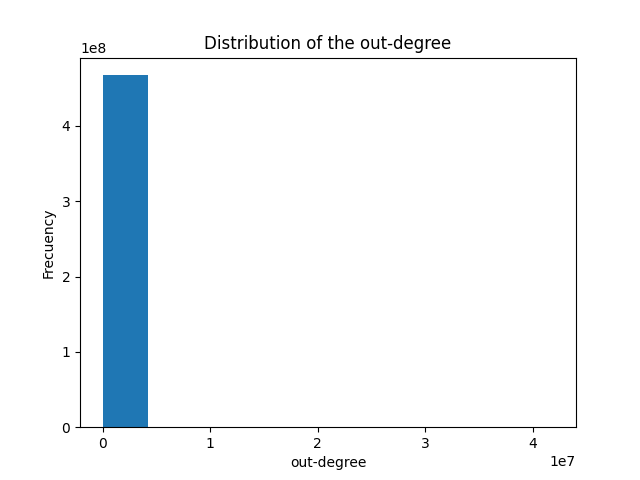

# Processing the Wikidata dataset
This repository is a collection of scripts to pre-process a dump Wikidata. All
the code was tested with the *latest-truthy* dump of Wikidata (June 9th, 2024).

## Filters
The first step is to apply some filters to the dump in order to reduce redundant
or unnecessary triples

### Filter 1: Remove labels and descriptions
This filter is aimed to remove descriptions of Subjects/Objects in multiple
languages, leaving only the English description

```sh
python remove_labels_and_descriptions.py --input <input .nt file> --output <output .nt file>
```


### Filter 2: Remove properties
This filter removes all the properties not starting with
"<http://www.wikidata.org/prop/". As a byproduct, this filter generates a file
named `removed_properties.txt` with all  properties removed.

```sh
python remove_properties.py --input <input .nt file> --output <output .nt file>
```


| Dataset                   | Number of triples  |
| ------------------------- | ------------------ |
| latest-truthy (original)  | 8,254,120,518      |
| After filter 1            | 2,276,362,123      |
| After filter 2            | 1,617,500,079 (26 properties deleted)      |

## Continuous identifiers 
The second step is to convert the filtered dataset into a new version using
continuous identifiers for the subject/objects and predicates. The output
dataset has extension `.nt.dat`. Additionally, two dictionaries are generate to convert identifiers to entries of
the filtered dataset, one for subjects/objects (extensión `.nt.dat.SO`) and one
for predicates (extension `.nt.dat.P`)

```sh
python continuous_ids.py --input <input .nt file>
```

## Statistics
This script computes some stats from the input .nt file, as a graph. In
particular, the computed stats are:
- in-degree and out-degree distribution (saved at in-degree.png and out-degree.png)
- Number of triples with predicate belonging to different subsets of
predicates. The subsets are given as an input file following the format
```
   #Subset1
   <predicate 1>
   <predicate 2>
   ...
   #Subset2
   <predicate 1>
   <predicate 2>
   ...
```
For an example, check the file sets_predicates.txt

```sh
python get_stats.py --input <input .nt file> --subset-preds <.txt file with the subset of predicates>
```

We obtained the following stats from our dataset:
- Frecuency of predicates [`P150`](http://www.wikidata.org/prop/direct/P150) and
[`P131`](http://www.wikidata.org/prop/direct/P131) (representing containment
relation) : 14,520,899
- Frecuency of predicate [`P47`](http://www.wikidata.org/prop/direct/P47)
(representing adjacency relation): 919,701

 
 
## Query engines


