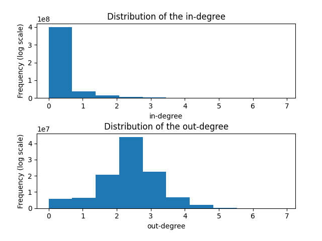

# Processing the Wikidata dataset
This repository is a collection of scripts to pre-process a dump Wikidata. All
the code was tested with the *latest-truthy* dump of Wikidata (June 9th, 2024).

## Filters
The first step is to apply some filters to the dump in order to reduce redundant
or unnecessary triples

### Filter 1: Remove labels and descriptions
This filter is aimed to remove descriptions of Subjects/Objects in multiple
languages, leaving only the English description

```sh
python remove_labels_and_descriptions.py < [input .nt file] > [output .nt file]
```


### Filter 2: Remove properties
This filter removes all the properties not starting with
"<http://www.wikidata.org/prop/". As a byproduct, this filter generates a file
named `removed_properties.txt` with all  properties removed.

```sh
python remove_properties.py < [input .nt file] > [output .nt file]
```

### Filter 3: Remove invalid edges related to containment relations/predicates
This filter removes all the triples that are invalid according to a containment relation. The script is intented to work only with
containment-related predicates, where a cycle can be considered as an error or a bug. However, the code is general enough
to be applied to other predicates. The filter works in two steps: 1) First, perform DFS traversals starting from at the vertices with in-degree 0, and 2) For all vertices not visited during the first step, perform a DFS traversal starting at an arbitrary vertex. As a byproduct, this filter generates a file named `removed_triples_cycle.txt` with all triples removed.
The list of predicates to be considered is given as an input file following the format
```
   <predicate 1> <direction>
   <predicate 2> <direction>
   ...
 ```
where `<direction>` indicates how to interprete the triple SPO (0: S--P-->O, 1: O--P-->S). The direction is used, in particular, for predicates related with
the containment relation. For an example, check the file `containment_predicates.txt`

```sh
python delete_cycles.py --input <input .nt file> --output <output .nt file> --subset-preds <.txt file with the subset of predicates>
```
## Summary
To apply all the filters to the Wikidata dump *latest-truthy.nt*, use

```sh
cat latest-truthy.nt | python3 remove_labels_and_descriptions.py | python3 remove_properties.py > latest-truthy_filtered.nt

python delete_cycles.py --input latest-truthy_filtered.nt --output latest-truthy_filtered_nocycles.nt --subset-preds cycle_predicates.txt
```

| Dataset                   | Number of triples  |
| ------------------------- | ------------------ |
| latest-truthy (original)  | 8,254,120,518      |
| After filter 1            | 2,276,362,123      |
| After filter 2            | 1,617,500,079 (26 properties deleted)      |
| After filter 3            | 1,615,616,023 (1,884,056 triples deleted)      |

## Continuous identifiers 
The second step is to convert the filtered dataset into a new version using
continuous identifiers for the subject/objects and predicates. The output
dataset has extension `.nt.dat`. Additionally, two dictionaries are generate to convert identifiers to entries of
the filtered dataset, one for subjects/objects (extensión `.nt.dat.SO`) and one
for predicates (extension `.nt.dat.P`)

```sh
python continuous_ids.py --input <input .nt file>
```

## Statistics
This script computes some stats from the input .nt file, as a graph. In
particular, the computed stats are:
- in-degree and out-degree distribution (saved at in-out-degree.png file). By default,
  a histogram of the whole graph is generated, but we can limit the maximum degree using
  the option `--max-deg`
- Top 10 in-degree and out-degree nodes (i.e. subjects or objects)
- Number of triples with predicate belonging to different subsets of
predicates. The subsets are given as an input file following the format
```
   #Subset1
   <predicate 1>
   <predicate 2>
   ...
   #Subset2
   <predicate 1>
   <predicate 2>
   ...
```
For an example, check the file `sets_predicates.txt`

```sh
python get_stats.py --input <input .nt file> --subset-preds <.txt file with the subset of predicates> --max-deg <limit degree>
```
### Stats from subsets of containment and adjacency relations 
- Frecuency of predicates [`P150`](http://www.wikidata.org/prop/direct/P150) and
[`P131`](http://www.wikidata.org/prop/direct/P131) (representing containment
relation) (filter 1 + filter 2): 14,520,899
- Frecuency of predicates [`P150`](http://www.wikidata.org/prop/direct/P150) and
[`P131`](http://www.wikidata.org/prop/direct/P131) (representing containment
relation) (filter 1 + filter 2 + filter 3): 12,636,843
- Frecuency of predicate [`P47`](http://www.wikidata.org/prop/direct/P47)
(representing adjacency relation): 919,701
- Frecuency of predicates [`P171`](http://www.wikidata.org/prop/direct/P171),
[`P279`](http://www.wikidata.org/prop/direct/P279), [`P1647`](http://www.wikidata.org/prop/direct/P1647) and
[`P397`](http://www.wikidata.org/prop/direct/P397) (representing containment
relation) (filter 1 + filter 2 + filter 3): 8,820,421

### General stats (After filter 1 + filter 2 + filter 3)
#### Top 10 subjects/objects with higher in-degree
1. [`Q13442814`](http://www.wikidata.org/entity/Q13442814): 41,928,868 (scholarly article -- article in an academic publication, usually peer reviewed)
2. [`Q1860`](http://www.wikidata.org/entity/Q1860): 14,149,995 (English -- West Germanic language)
3. [`Q5`](http://www.wikidata.org/entity/Q5): 11,861,436 (human -- any member of Homo sapiens)
4. [`Q1264450`](http://www.wikidata.org/entity/Q1264450): 8,081,235 (J2000.0 -- epoch in astronomy)
5. [`Q6581097`](http://www.wikidata.org/entity/Q6581097): 6,851,060 (male -- to be used in "sex or gender" ([P21](http://www.wikidata.org/prop/direct/P21)) or "semantic gender" ([P10339](http://www.wikidata.org/prop/direct/P10339)))
6. `1`: 5,603,026
7. [`Q4167836`](http://www.wikidata.org/entity/Q4167836): 5,385,408 (Wikimedia category -- use with 'instance of' ([P31](http://www.wikidata.org/prop/direct/P31)) for Wikimedia category)
8. `2`: 4,818,801
9. `3`: 4,320,894
10. `4`: 3,918,407

#### Top 10 subjects/objects with higher out-degree
1. [`Q39790431`](http://www.wikidata.org/entity/Q39790431): 8,348 (BayGenomics: a resource of insertional mutations in mouse embryonic stem cells -- scientific article published on January 2003)
2. [`Q6382438`](http://www.wikidata.org/entity/Q6382438): 6,704 (Shigella sonnei -- species of bacterium)
3. [`Q213019`](http://www.wikidata.org/entity/Q213019): 6,479 (The War of the Worlds -- 1898 novel by H. G. Wells)
4. [`Q1644417`](http://www.wikidata.org/entity/Q1644417): 6,278 (Shigella flexneri -- species of bacterium)
5. [`Q21600865`](http://www.wikidata.org/entity/Q21600865): 5,662 (Salmonella enterica subsp. enterica -- subspecies of bacterium)
6. [`Q112113034`](http://www.wikidata.org/entity/Q112113034): 5,560 (Death following pulmonary complications of surgery before and during the SARS-CoV-2 pandemic -- scientific article published on 13 November 2021)
7. [`Q56836084`](http://www.wikidata.org/entity/Q56836084): 5,480 (40 EASD Annual Meeting of the European Association for the Study of Diabetes : Munich, Germany, 5-9 September 2004 -- article)
8. [`Q64022985`](http://www.wikidata.org/entity/Q64022985): 5,225 (Combinations of single-top-quark production cross-section measurements and |fLVVtb| determinations at sqrt(s) = 7 and 8 TeV with the ATLAS and CMS experiments -- article)
9. [`Q21558717`](http://www.wikidata.org/entity/Q21558717): 5,200 (Combined Measurement of the Higgs Boson Mass in pp Collisions at sqrt(s)=7 and 8 TeV with the ATLAS and CMS Experiments -- scientific article )
10. [`Q56754739`](http://www.wikidata.org/entity/Q56754739): 5,128 (Measurements of the Higgs boson production and decay rates and constraints on its couplings from a combined ATLAS and CMS analysis of the LHC pp collision data at sqrt(s)=7 and 8 TeV -- article)

#### In-degree and out-degree distribution (with --max-deg 1000)
 

## Query engines


